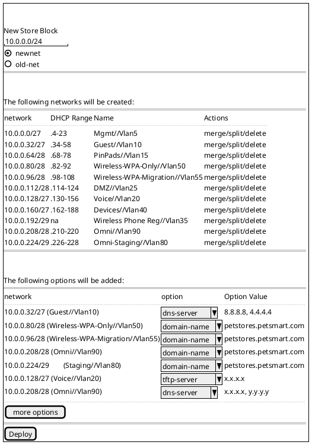

# flask-apache-setup

# Petsmart Requirements

Petsmart as requested for the following workflows on BlueCat Gateway to support automation of their new store automation

## Workflow - New Store Setup

### Overview
This workflow handles the following
+ Provides the user an interface to add a new IP4Block for a new store
+ Provides the user with a set of networks as specified by the new-store network breakup
+ Provides the user with a set of DHCP scopes as specified by the new-store DHCP breakup
+ Provides the user with a set of options as specified by the new-store options 
+ Provides the user an interface to add a new IP4Network according to the old-net criteria

### UI
 
#### Screen 1

The user needs to enter the CIDR and select either a new-net or old-net format.
The screen automatically presents the user with the criteria for a new store.



PS:
+ The workflow will only allow the following limited set of options to be specified:
++ DNS Servers
++ Minimum Lease Time
++ Maximum Lease Time
++ Domain Name
++ TFTP Server

## Install Python3 and Apache with WSGI

```
sudo apt install python3-pip
sudo apt install python-dev
sudo apt install apache2 libapache2-mod-wsgi-py3
```

## Install Python modules as required

```
sudo pip3 install requests flask pandas
```

## Copy Basic Apache config for mycompany

```
<VirtualHost *:80>
		ServerName mywebsite.com
		ServerAdmin admin@mywebsite.com
		WSGIScriptAlias / /var/www/mycompany/mycompany.wsgi
		<Directory /var/www/mycompany/mycompany/>
			Order allow,deny
			Allow from all
		</Directory>
		Alias /static /var/www/mycompany/mycompany/static
		<Directory /var/www/mycompany/mycompany/static/>
			Order allow,deny
			Allow from all
		</Directory>
		ErrorLog ${APACHE_LOG_DIR}/error.log
		LogLevel warn
		CustomLog ${APACHE_LOG_DIR}/access.log combined
</VirtualHost>
```

## Enable FlaskApp on Apache

```
sudo a2ensite mycompany
sudo systemctl reload apache2
```

## Setup WSGI 

```
cd /var/www/
mkdir -p mycompany/mycompany
sudo vi mycompany/mycompany.wsgi

----------------------------------------
#!/usr/bin/python3
import sys
import logging
logging.basicConfig(stream=sys.stderr)
sys.path.insert(0,"/var/www/mycompany/mycompany")

from mycompany import app as application
application.secret_key = 'Add your secret key'
----------------------------------------
:wq

sudo chmod -R www-data:www-data mycompany/
sudo chmod -R www-data:www-data mycompany/*
sudo service apache2 restart
```

## Basic Flask App

sudo vi /var/www/mycompany/mycompany/__init__.py
sudo vi /var/www/mycompany/mycompany/mycompany.py

```
from flask import Flask
app = Flask(__name__)

@app.route('/')
def demo():
    return F"<h1> My company is under construction, please check back later <h1>", 200

if __name__ == '__main__':
    app.run()
```

